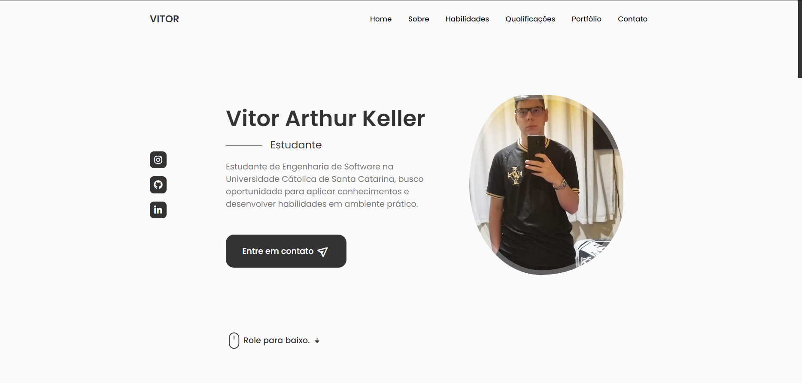

<h1 align="center">
   Portfólio
</h1>

<h4 align="center"><a href="https://vitorkeller1604.github.io/Portfolio/">Clique para visitar o projeto</a></h4>

## 🙋‍♂️ Sobre mim
Olá, sou Vitor Arthur Keller, estudante de Engenharia de Software em formação e este é meu primeiro portfólio. Aqui você pode encontrar mais informações sobre minha trajetória acadêmica e como programador, além de poder visualizar meu currículo e experiências profissionais.

---

## 💻 Tecnologias utilizadas

Para o desenvolvimento deste site utilizei as seguintes tecnologias:

- HTML.
- CSS.
- JavaScript.
